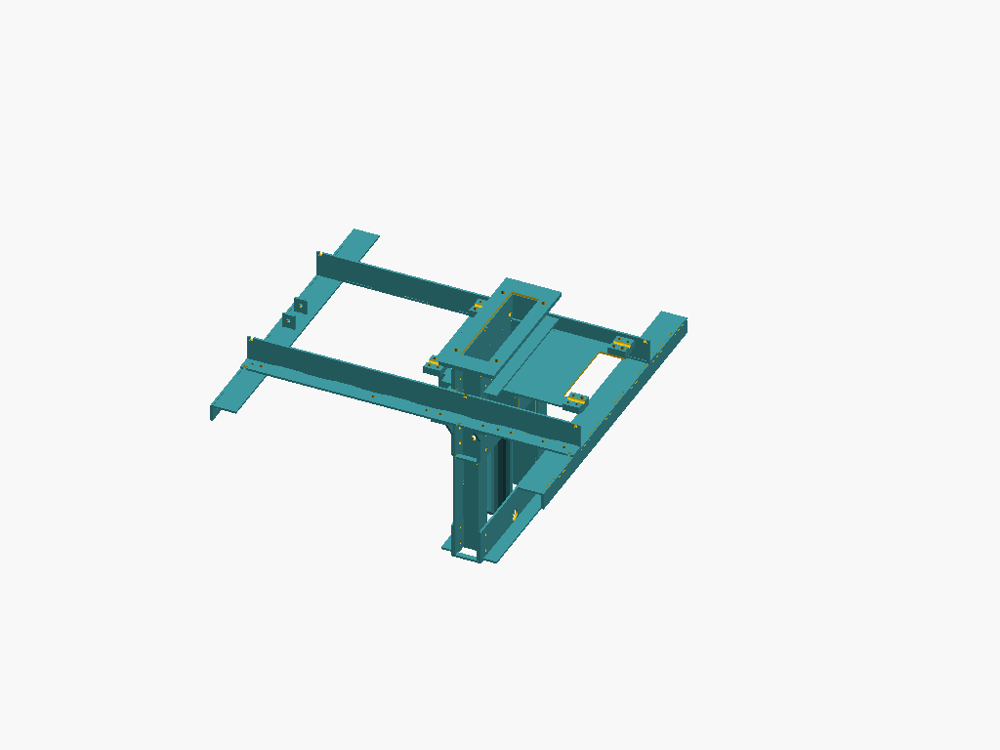

# Compressed Earth Block Press

## CNC Cutting Layouts

The CNC layouts are split by material thickness for easier manufacturing. The thickness (in inches) is appended to the filename without the decimal point (e.g., `05` for 0.5", `0125` for 0.125").

### All Parts

### 0.5" Thickness (Drawer, Frame, Arm Parts)

### 0.125" Thickness (Guard/Hopper Parts)

parametric ceb press using OpenSCAD

https://wiki.opensourceecology.org/wiki/Ceb_press

https://en.wikipedia.org/wiki/Compressed_earth_block
